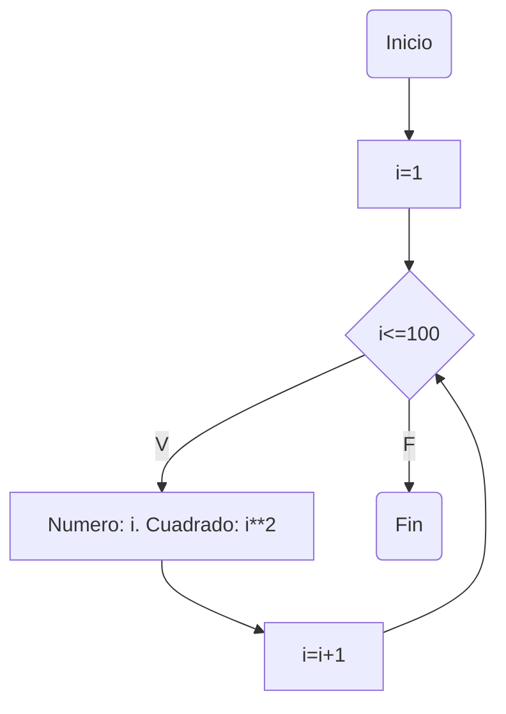
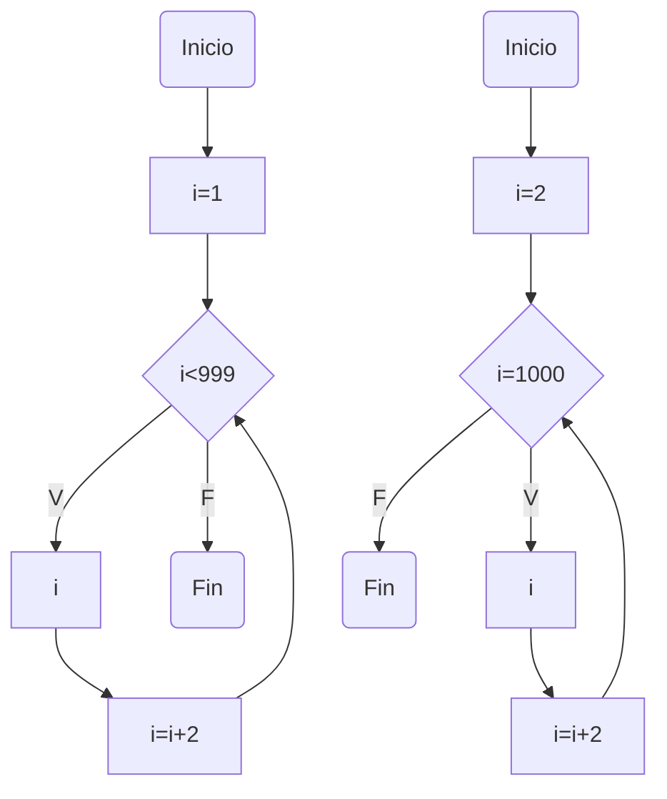
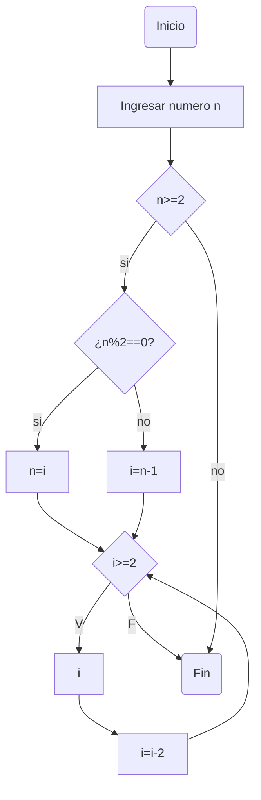

# Reto_7

### 1. Imprimir un listado con los números del 1 al 100 cada uno con su respectivo cuadrado.

```
i = 1
while i <= 100:
    print(f"Número: {i}, Cuadrado: {i**2}")
    i += 1
```



### 2. Imprimir un listado con los números impares desde 1 hasta 999 y seguidamente otro listado con los números pares desde 2 hasta 1000.

```
print("Números impares:")
i = 1
while i <= 999:
    print(i)
    i += 2


print("\nNúmeros pares:")
i = 2
while i <= 1000:
    print(i)
    i += 2
```



### 3. Imprimir los números pares en forma descendente hasta 2 que son menores o iguales a un número natural n ≥ 2 dado

```
n = int(input("Ingrese un número natural mayor o igual a 2: "))

if n >= 2:
    print("\nNúmeros pares descendentes hasta 2:")
    i = n if n % 2 == 0 else n - 1  
    while i >= 2:
        print(i)
        i -= 2
else:
    print("El número ingresado no es válido.")
```



### 4. En 2022 el país A tendrá una población de 25 millones de habitantes y el país B de 18.9 millones. Las tasas de crecimiento anual de la población serán de 2% y 3% respectivamente. Desarrollar un algoritmo para informar en que año la población del país B superará a la de A.

```
poblacion_a = 25
poblacion_b = 18.9
tasa_crecimiento_a = 0.02
tasa_crecimiento_b = 0.03
anio = 0

while poblacion_b <= poblacion_a:
    poblacion_a *= (1 + tasa_crecimiento_a)
    poblacion_b *= (1 + tasa_crecimiento_b)
    anio += 1

print(f"En el año {2022 + anio} la población del país B ({poblacion_b:.2f} millones) superará a la del país A ({poblacion_a:.2f} millones).")
```

### 5. Imprimir el factorial de un número natural n dado.

```

```

### 6. Implementar un algoritmo que permita adivinar un número dado de 1 a 100, preguntando en cada caso si el número es mayor, menor o igual.

```

```

### 7. Implementar un programa que ingrese un número de 2 a 50 y muestre sus divisores.

```

```

### 8. Implementar el algoritmo que muestre los números primos del 1 al 100. Nota: use funciones

```

```
