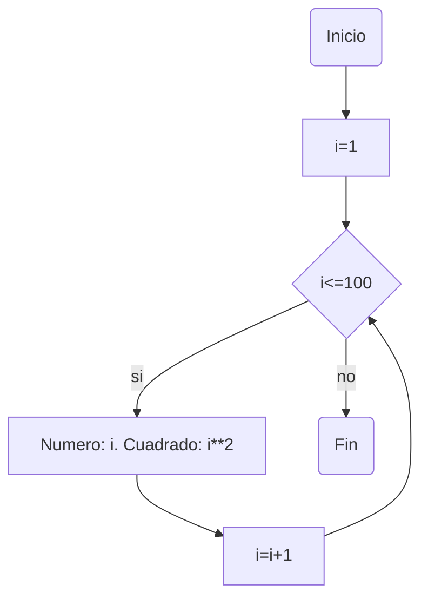
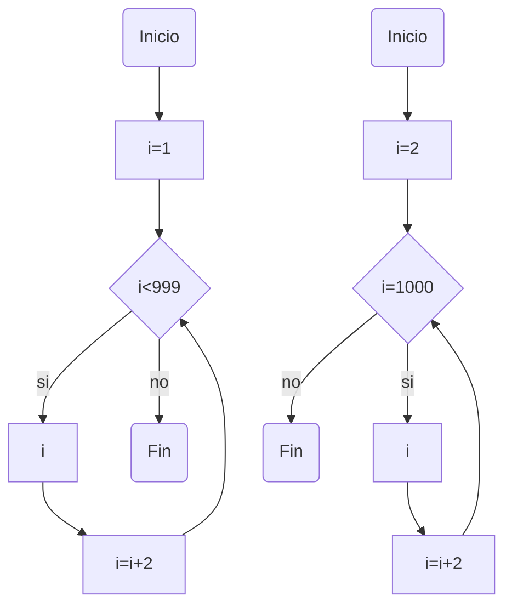

# Reto_7

### 1. Imprimir un listado con los números del 1 al 100 cada uno con su respectivo cuadrado.

```
i = 1
while i <= 100:
    print(f"Número: {i}, Cuadrado: {i**2}")
    i += 1
```



### 2. Imprimir un listado con los números impares desde 1 hasta 999 y seguidamente otro listado con los números pares desde 2 hasta 1000.

```
print("Números impares:")
i = 1
while i <= 999:
    print(i)
    i += 2


print("\nNúmeros pares:")
i = 2
while i <= 1000:
    print(i)
    i += 2
```


